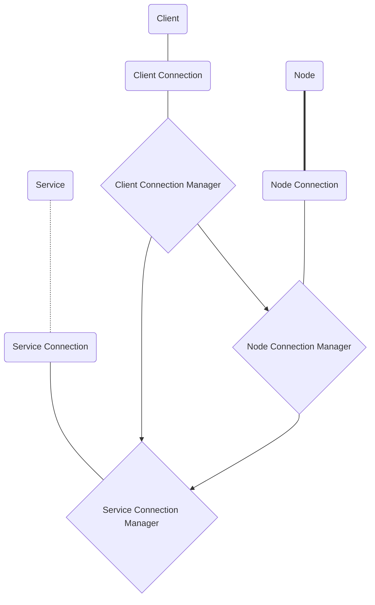
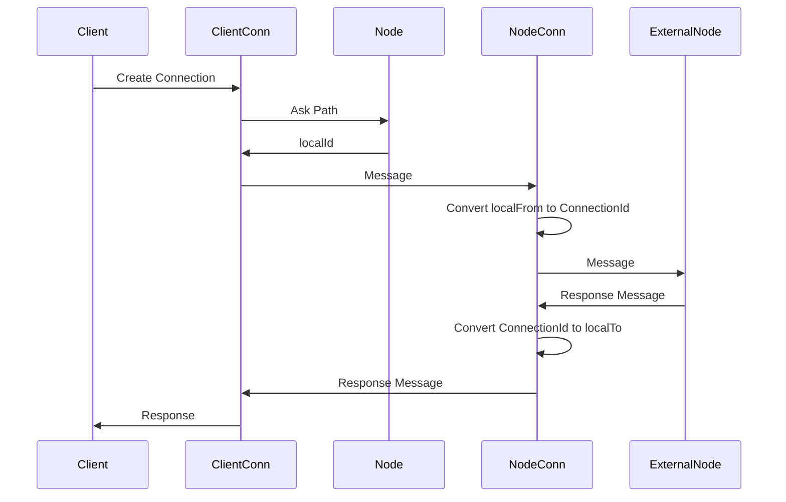
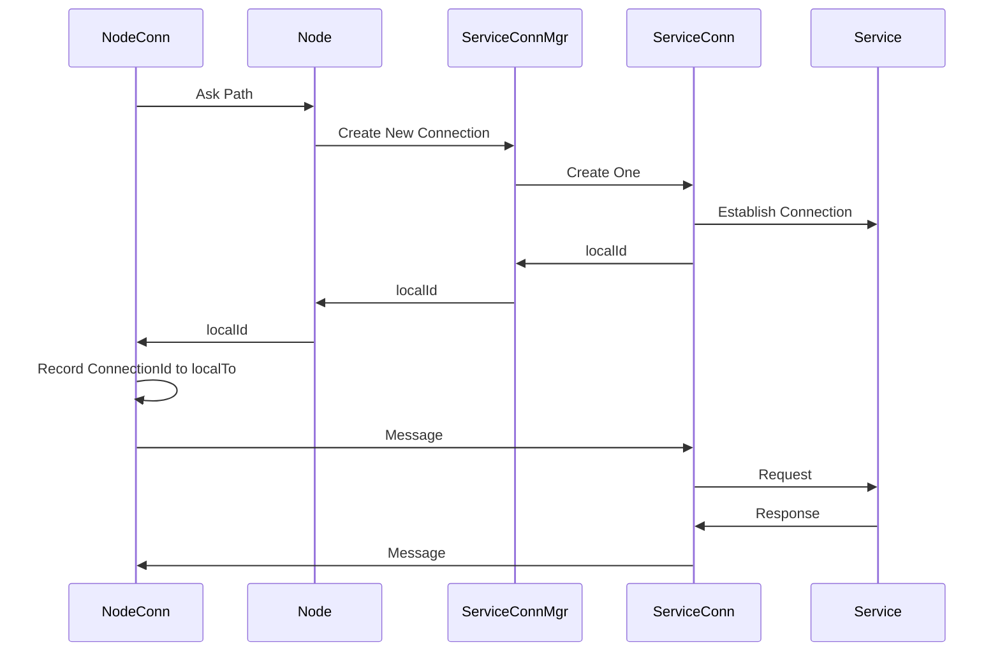

# LocalStar

### Comm
### TODO - SHORT TERM
1. Message 에서 url로 초기화 부분 구현
    1. Node에서 최단경로 찾는부분 구현
    2. NodeConnectionManager 에서 해당 노드로 가는길 찾는부분 구현
    3. ServiceConnectionManager 에서 해당 서비스로 가는길 찾는부분 구현
    4. Message에서 ConnectionType이 Init일 경우 ServiceManager에 미리 요청해서 Connection 만들어두기
2. Pipe loop 구현

2. NodeStream 에서 Header 및 통신부분 구현
    1. Message 에서 직접 Header 만드는 방향으로

### TODO - LONG TERM
1. DNS
2. Message
3. Node
4. NodeManager
5. NodeConnection
    1. NodeStream
6. NodeConnectionManager
7. Service
8. ServiceManager
    1. NodeId랑 같은 이름을 가지는 서비스 자동생성 고려
9. ServiceConnection
10. ServiceConnectionManager
11. NodeService
    *. 자기 자신에대한 정보를 http로 공유하는 서비스. 별도의 포트로 접속가능. 실행시 자동으로 등록.

### Node 데이터 순환구조.
    1. 처음 접속한 노드는 주변 노드에 접속을 시도하며 바로 노드 데이터 요청 메세지를 전송함.
    2. 접속 가능한 모든 노드를 탐색 완료하면 평시상태로 들어감.
    3. 요청 주기는 설정한 시간마다 되풀이
    4. 접속 가능한 모든 노드에게 자료 요청을 날림.
    5. 자료 교류에는 NodeManager에 CurrentNode가 그대로 보내짐.
    6. 받은쪽에서는 하위 노드중 자기 자신을 전부 제거하고 자신의 Child에 추가함. (재귀 방지)
## 프로그램구조

## 다른노드와의 연결 성립

